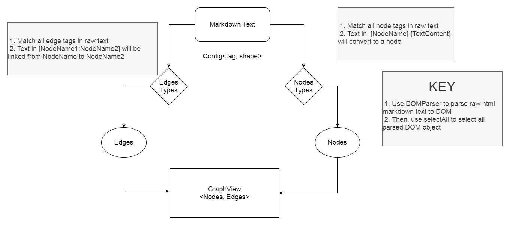

# React Markdown to Graph

Visualize your markdown syntax to graph

-   Efficiently transfer your markdown document to visualized graph
-   Easily download your graph
-   Conveniently save your graph and markdown document

[Example](https://pauljay611.github.io/react-mdToGraph/)

---

## Tech Stack

-   React v16.13.1
-   React-ace v9.1.2
-   React-digraph v7
-   Styled-component v5.1.1
-   Material-ui v4.11
-   Markdown-it v11

## Library

-   [React-Ace Editor](https://github.com/securingsincity/react-ace)

    -   Markdown editor

-   [React-digraph](https://github.com/uber/react-digraph)

    -   Graph visualization

-   [Markdown-it](https://github.com/markdown-it/markdown-it)
    -   Render and transfer markdown to HTML String

## Installation

```
- cd ./react-mdToGraph
- npm install
- npm start
```

## How to draw a node

First, we need to know that graph is compose by nodes and edges, so the first thing is setting up our node html tag and edge html tag.

1. Setting up your node and edge in markdown tag, shape and type text on setting popup.

Next, let's start connecting each nodes by edges. Using bracket to create and register a node in available nodeName, which can make the edges know where the node is.

2. Type `# [nodeName1] {content}` in md-editor, then see the graph node.

Edges is important to connect two nodes. Using colon sign to represent node's 'from and to' and right side is 'from' and left is 'to'.

3. Type `nodeName1:nodeName2`

Start markdown it and making your own graph!

## How does the markdown text compile to each nodes and edges



```
# [md-test] md-text in editor
## [nodes-type] nodes settings in <type<Node>, markdownTag, shape, text>
## [edges-type] edges settings in <type<Edge>, markdownTag, shape, text>
### [nodes] nodes type in <type, title, props>
### [edges] edges type in <type, source, target, props>
# [graph-view] graph view
- md-test:nodes-type
- md-test:edges-type
- nodes-type:nodes
- edges-type:edges
- nodes:graph-view
- edges:graph-view
```
